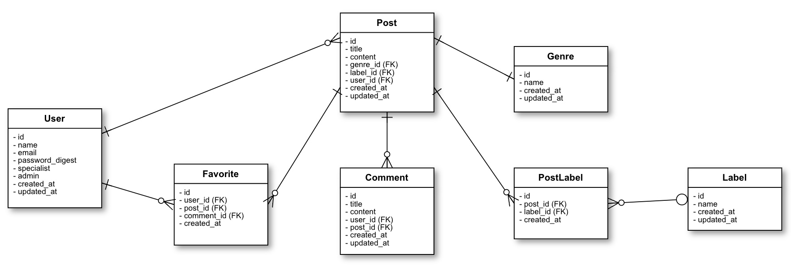
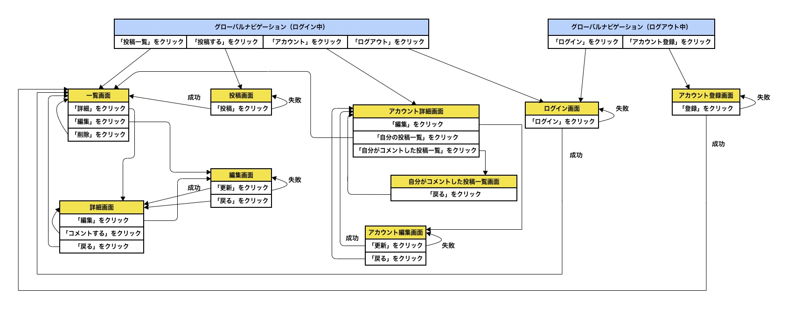

# README

## 開発言語
- Ruby 3.1.3
- Rails 6.1.7.2

## 就業Termの技術
- devise
- Ajaxを使ったコメント機能

## カリキュラム外の技術
- gem/cancancan

## 実行手順
````
$ git clone https://github.com/Takuya-Shimizu/original_app.git
$ cd original_app
$ bundle install
$ rails db:create && rails db:migrate
$ rails s
````

## チェックシート
https://docs.google.com/spreadsheets/d/1jEQr6j55wDRo-A6KAVrvqqaDAUKWt6IQqGPR4OfgoqI/edit?usp=sharing

## カタログ設計
https://docs.google.com/spreadsheets/d/1jEQr6j55wDRo-A6KAVrvqqaDAUKWt6IQqGPR4OfgoqI/edit?usp=sharing

## テーブル定義書
https://docs.google.com/spreadsheets/d/1jEQr6j55wDRo-A6KAVrvqqaDAUKWt6IQqGPR4OfgoqI/edit?usp=sharing

## ワイヤーフレーム
https://cacoo.com/diagrams/imwXF3UKkcaug2yX/35B2F

## ER図


## 画面遷移図
